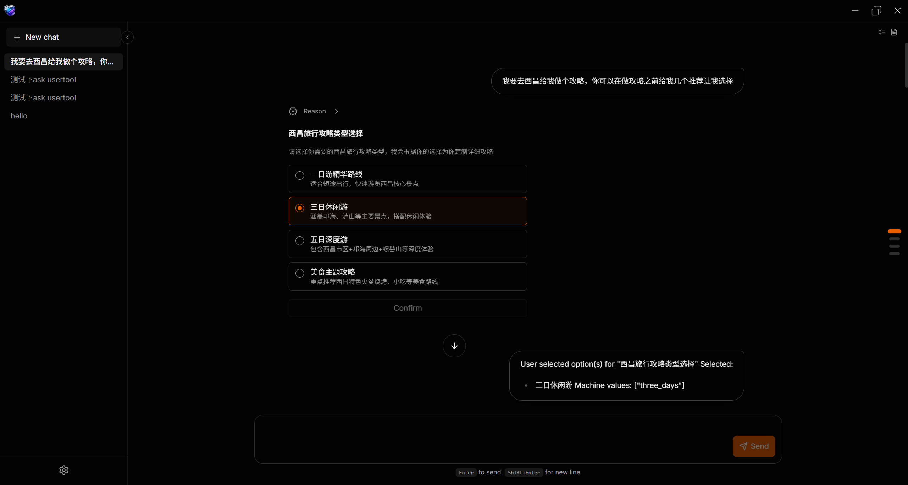

# vide

This is an Electron-based LLM agent application.

  

## Build

- `pnpm prebuild`: build the Electron main process, preload script, and renderer bundle.
- `pnpm build`: create local desktop packages in `apps/main/dist/electron-pack`.
- `pnpm release`: build and publish release assets, intended for the tag-triggered GitHub workflow.

## GitHub Workflows

- `.github/workflows/build.yml`: run the bundle build on pushes to `main` and on pull requests.
- `.github/workflows/release.yml`: publish release assets when a `v*` tag is pushed or when the workflow is triggered manually.
